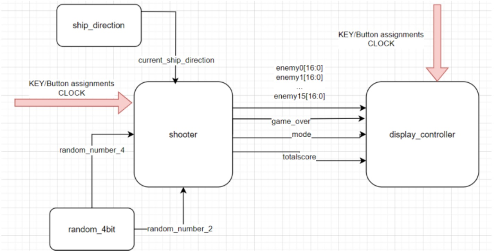
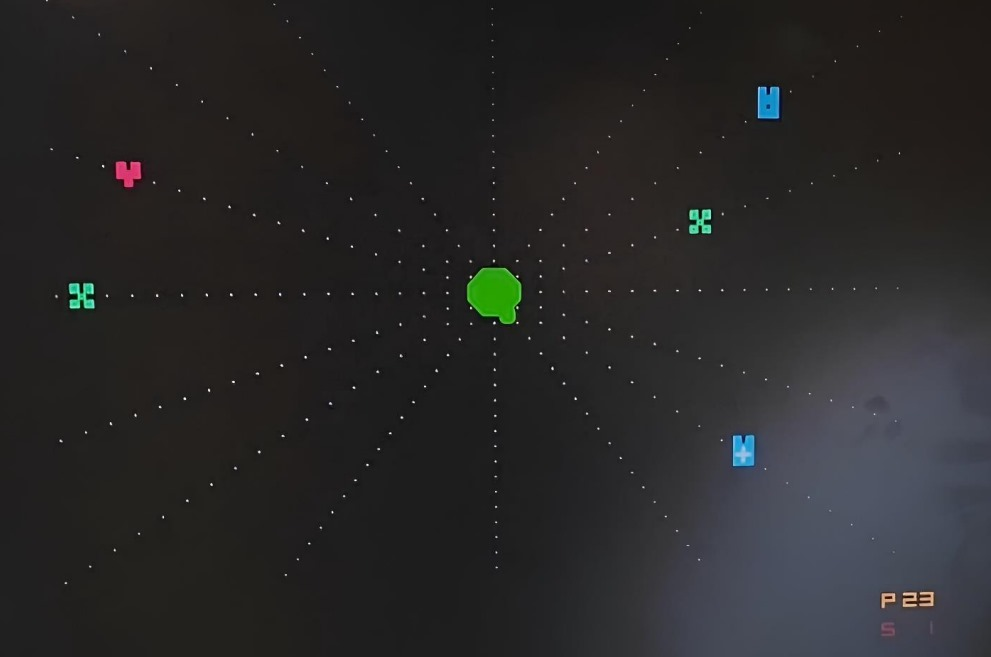
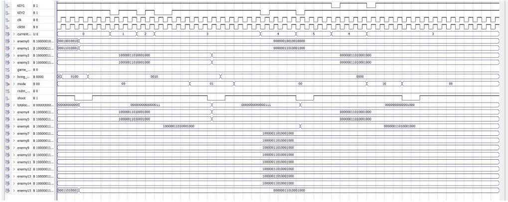

# FPGA-Based Isometric Shooter Game

**EE314 — Digital Electronics Laboratory, Spring 2024**  
**Middle East Technical University (METU)**  
**Group 48 — Emirhan Yolcu, Bora Özkan, Alkım Bozkurt**

---

## 🎮 Project Overview
This project was developed as the **term project for the EE314 Digital Electronics Laboratory course**, where we were tasked with creating an **isometric shooter game** implemented entirely in **Verilog HDL** and deployed on an **FPGA platform** using a VGA display.

The game is inspired by the classic *Space Invaders*, featuring a **central spaceship** that rotates to defend itself against waves of enemies approaching from multiple directions.  
The player can choose between three different **shooting modes**, each with unique damage and spread patterns.  
All game logic — including object rendering, score tracking, collision detection, and enemy spawning — was designed in hardware without using any microcontroller.

---

## 🧩 System Architecture
The design consists of multiple Verilog modules, each responsible for a distinct functionality:
- **Shooter Module:** Core gameplay logic — enemy dynamics, shooting, collisions, and scoring  
- **VGA Controller:** Handles pixel-level rendering of the spaceship, enemies, and background  
- **Ship Direction Module:** Tracks user input from FPGA keys to control spaceship rotation  
- **Random Number Generator (LFSR):** Ensures randomized enemy spawning and types  
- **Mode Selection Logic:** Uses FPGA switches to change firing modes in real-time  

  
  
<em>Figure 1. Overall FPGA-based shooter system architecture.</em>

---

## 🕹️ Gameplay Mechanics
- **Spaceship Rotation:** Controlled via FPGA keys (CW / CCW)
- **Enemy Spawning:** Randomized direction and type generation with LFSR  
- **Enemy Types:** Three enemy classes with different health and shapes  
- **Shooting Modes:**
  - Mode 0 — Wide spread, low damage  
  - Mode 1 — Balanced spread and damage  
  - Mode 2 — Focused shot, high damage  
- **Score System:** Incremented in real time upon destroying enemies and displayed on VGA  
- **Game Over:** Triggered when any enemy reaches the center (the player’s spaceship)

  
  
<em>Figure 2. Sample game view on VGA display.</em>

---

## 💡 Technical Details
- **Language:** Verilog HDL  
- **FPGA Platform:** Intel / Altera DE-series board  
- **Display:** VGA 640×480 @ 60Hz  
- **Pixel Rendering:** RGB 8-bit color mapping per object  
- **Clock Frequency:** 25 MHz (for VGA timing compatibility)  
- **Code Size:** Over 7,000 lines of Verilog  
- **Simulation Tool:** Quartus Waveform Simulator  

  
  
<em>Figure 3. Quartus simulation results validating module timing and VGA sync.</em>

---

## ⚙️ Project Achievements
- Fully functional **isometric shooter game** designed from scratch using hardware logic only  
- Successful VGA rendering with stable 60Hz refresh rate  
- Dynamic and random enemy behavior generated via LFSR module  
- Real-time collision handling and score display  
- Modular, scalable architecture exceeding 7,000 lines of Verilog code  

---

## 🧾 Evaluation & Grade
This project received **112 / 100 points** 
The base term project score was **100**, and we earned an additional **12 bonus points** out of 15 for design quality, functionality, and code modularity.

---

## 📁 Repository Structure
